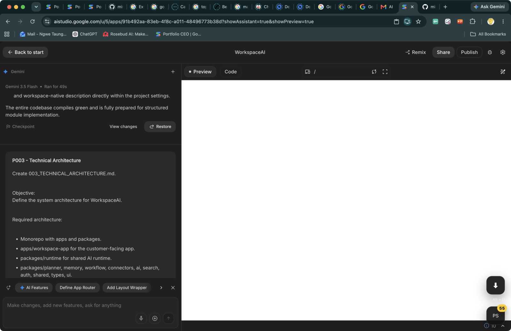
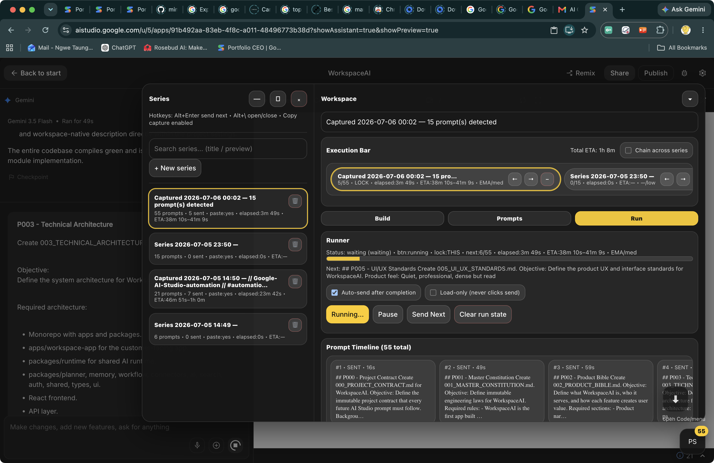
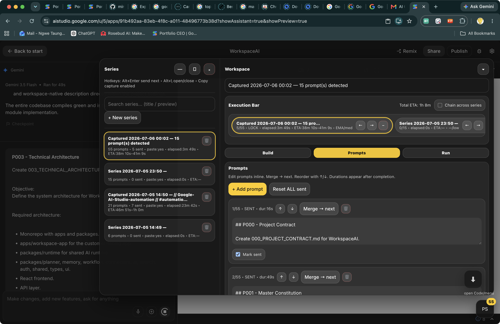
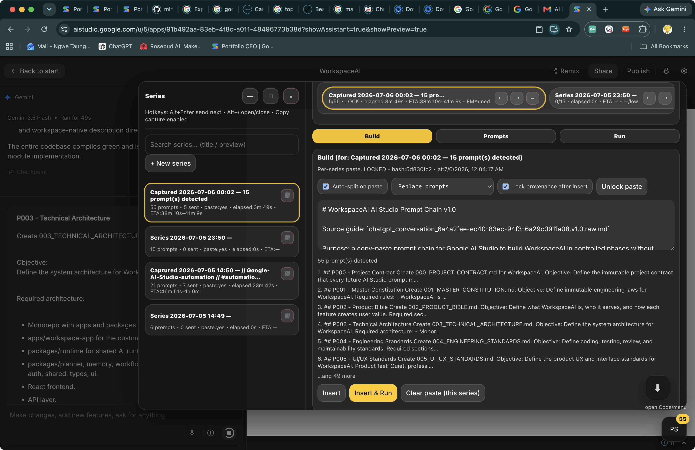
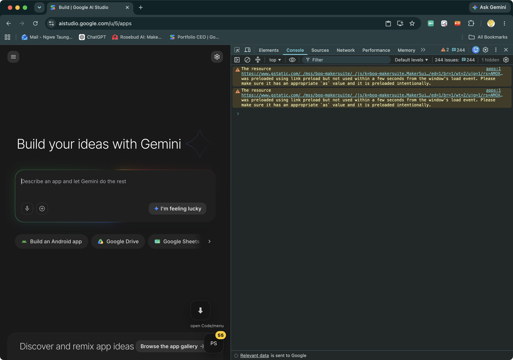

# Google AI Studio Automation

Console-paste automation tools for Google AI Studio app building workflows.

## Features

- Prompt Bubble UI for managing prompt chains.
- Prompt-pack detection for staged Markdown prompt packs.
- AI Studio start-page support for `Describe an app...` plus `Build`.
- AI Studio editor support for `Make changes...` plus Send.
- Auto retry and auto-fix helpers.
- Google Drive allow-access countdown helper.
- Download overlay with `Alt+D`.

## Screenshots

Prompt Bubble badge in the AI Studio editor:



Run tab with full prompt timeline:



Prompts tab for reviewing and editing detected prompts:



Build tab with prompt-pack import and detection:



## Use

Copy the full script:

```bash
pbcopy < google_ai_studio_automation.js
```

Open Google AI Studio, open DevTools Console, paste, and press Enter.



If Chrome blocks console paste, type:

```text
allow pasting
```

## Controls

- `PS` bubble: open Prompt Bubble.
- `Alt+\`: open or close Prompt Bubble.
- `Alt+Enter`: send next prompt.
- `Alt+D`: trigger the download helper.

Useful console commands:

```js
__psbShow()
__dlbShow()
__psbStop()
__dlbStop()
```

## Files

- `google_ai_studio_automation.js`: full console-paste bundle.
